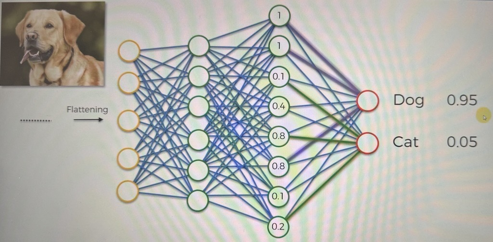
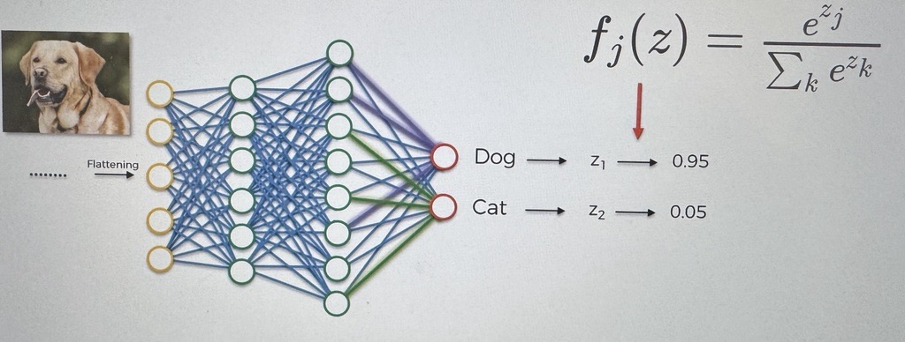
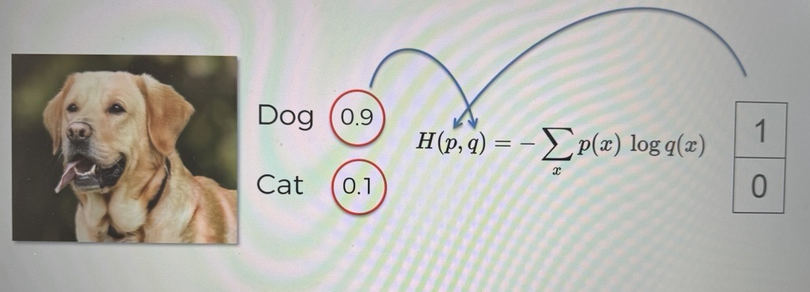
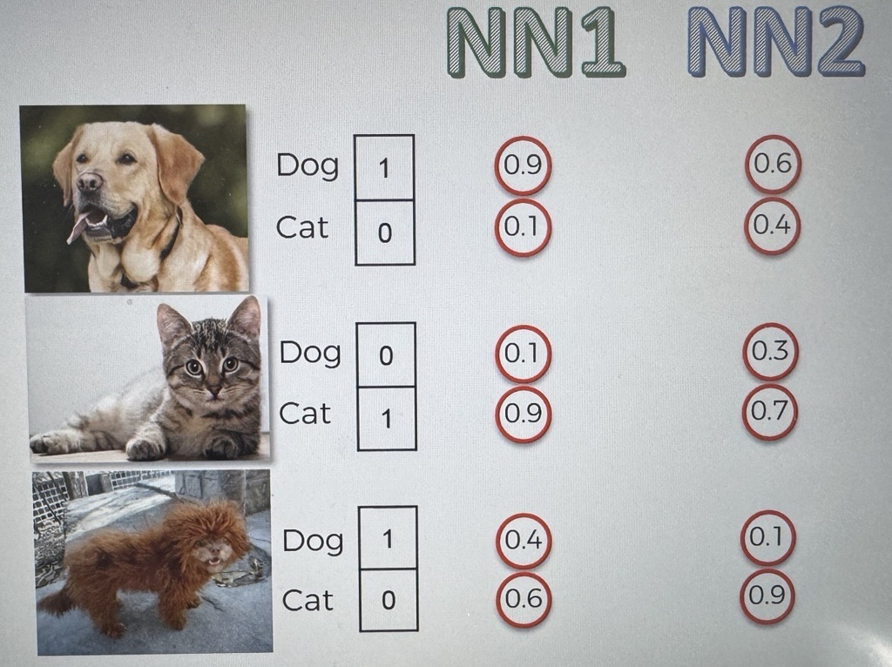

# Softmax & Cross-Entropy

Let's start with the CNN from section 3.23

Why do the 2 output values add up to 1?
How do they know that the values need to add up to 1?
How do they know eachother probabilities?

The answer is that they wouldn't know that the values need to add up to 1, in the classic version of ANNs

the only reason they know is because we introduced a special function called a soft max function

$$f_j(z) = \frac{e^{z_j}}{\sum_k e^{z_k}}$$

where j is the number you're trying to find the value $$f_j(z)$$ for and k is the indeces of the numbers

### for example:

your output values are:

- 57 : dog
- 54 : cat

your k values would be:

- Dog : 1
- Cat : 2

your function for dog would look like

your $$z_j = 57$$

$$f_j(57) = \frac{e^{57}}{e^{57} + e^{54}}$$

your $$f_j(57) = .95$$
and your $$f_j(54) = .05$$

normally the percentage probability values that the output neurons output would have any kind of real values.

we apply the softmax function to the output values, and that would bring the values to be between 0 and 1, where the sum of the values is 1

the reason to introduce this into CNNs is because the values may output by the output neurons won't always have perfectly adding up percentages, this is for us to understand better

the softmax function comes hand in hand with the cross entropy function

Cross Entropy Function Formula:

$$ L*i = -\log(\frac {e^{f*{y_i}}}{\sum_j e^{f_i}})$$

we will use the following version

$$ H(p,q) = -\sum_x p(x) \log q(x)$$

we will use this representation because the result is basically the same, but the result is easier to calculate

we will explain the math later

### What is a cross entropy function?

previously in ANNs we had a function called a mean squared error function, that we used as the cost function for assessing our network performance to minimize the C value

in CNNs the better option is to use the cross entropy function to figure out the C value

the function is not called the cost function in CNNs, it is called the loss function, they are very similar for our purposes

we want to minimize the loss function value

### Example

let's say we are training the CNN and we put an image of our dog into the CNN.

the predicted values by the CNN are:

- .9 : dog
- .1 : cat

the labels (since this is training, these numbers are the ones we set, and what we want the NN to output close to):

- 1 : dog
- 0 : cat

the predicted values correspond to q

the actual values correspond to p

##### Application/Explanation

let's assume we have 2 NNs

we pass 3 images

1. A Dog
2. A Cat
3. A weird looking dog

we want to see what our NNs predict (in red Circles)

Throughout all 3 images, NN1 was outperforming NN2

Now we will look at the Loss Functions

- NN1

| Row | Dog^ | Cat^ | Dog | Cat |
| --- | ---- | ---- | --- | --- |
| #1  | 0.9  | 0.1  | 1   | 0   |
| #2  | 0.1  | 0.9  | 0   | 1   |
| #3  | 0.4  | 0.6  | 1   | 0   |

- NN2

| Row | Dog^ | Cat^ | Dog | Cat |
| --- | ---- | ---- | --- | --- |
| #1  | 0.6  | 0.4  | 1   | 0   |
| #2  | 0.3  | 0.7  | 0   | 1   |
| #3  | 0.1  | 0.9  | 1   | 0   |

let's see what kind of errors we get

- Classification Error (how many were wrong)

  - NN1:
    $$1/3 = 0.33$$
  - NN2:
    $$1/3 = 0.33$$
  - from this standpoint both perform at the same level
  - This type of error calculation is not a good measure especially for the purposes of backpropogation

- Mean Squared Error

  - NN1:
    $$.25$$
  - NN2:
    $$.71$$
  - This is more accurate, telling us that NN1 has a much lower error rate

- Cross-Entropy
  - NN1:
    $$.38$$
  - NN2:
    $$1.06$$

The question of why would you use the Cross-entropy instead of mean squared error is answered in this way:

- There are several advantages for using cross-entropy over mean squared error, which are not obvious

  - if for instance at the very start of your backpropogation (if you use MSE), your output value is very tiny, then the gradient in your gradient descent will be very low, thus it would be harder for the NN to adjust the weights in the correct direction, whereas if you use cross-entropy (due to the logarithm in it) it helps the network assess even a small error like that

    - for example, if your change is from 1/1000000 to 1/1000, the change is not that much, and the MSE will reflect that and the backpropogation guidance will be slow, but if you use the CE method, the log in it will make it more apparent

    _cross entropy would only be preferred for classification, if you're working with things like regression, then MSE would be better_
