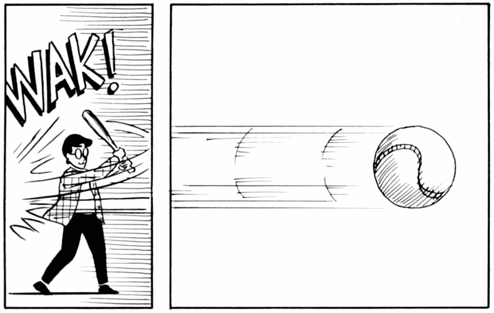

# Intoduction to the MDN-RNN

The wuestion we are trying to answer is:

- Why do we need them

[We will be following along with world models](https://worldmodels.github.io/)

the authors drew an analogy between ANNs and how baseball is played

- the thing about baseball is that
  - the speed at which a ball travels in the professional leagues is very fast
  - the time it takes for the ball to get to the bat is ~.4 seconds
  - the average human reaction time to visual stimulus is .25 s
- the commentary for this section goes as follows:
  - players can't swing after their reaction to when the ball is thrown
  - players rely on their prediction of the ball's path
    - this is what we want to implement in our ANN

The way to implement the last bullet point is to implement RNNs and a MDN

this is a visual representation of that

- the way we will using that is by the following
  - we will leverage an RNN to have a short term memory of what is going on in the env
    - as stuff happens, it keeps itself up to date on what is happenning (like a Gated Recurring Unit RNN). it pushes its outputs to the next state in time
  - why is this important?
    - going back to the baseball example
      - you can look at the pitchers different states through time, and predict when they will throw, and anticipate the throw
    - here is a clearer example
      - for \_\_\_\_
        - can you predict the word that goes after "for"
          - No, there isn't enough context (or history)
      - Too cool for \_\_\_\_
        - How about now?
          - it's easier now to predict, using previous memories, and context, that the full phrase is
            - "Too cool for school"
      - This is all just to say that we can't just look at the current state to make a prediction, we need information from the past, and context to make an accurate prediction

So now the question is:

## What is the Mixture Density Network?

this is what we will cover in the next lessons, but for now, what we will say is that it is necessary to make a non-deterministic prediction

- we don't want to say that our prediction is guranteed to happen, because we don't know for sure
  - we want to make a prediction that has a probability distribution

each time we are trying to predict the next latent input vector (the next state of the environment), but we don't want to predict exactly what the next state is, but a probability distribution of the states that it could be, and sample that distribution to train our NN on different possibilities on what might happen in the future

## Comparing to VAEs

- VAEs give what the environment can potentially look like
  - models space
- MDN-RNNs give options and variations of time, and how the future can look like
  - models time

there is a good example of what happens if the MDN-RNN and a VAE are connected compared to just a VAE being run, using a videogame car

- the car drives better when the MDN is implemented because it can predict possibilities of the future
